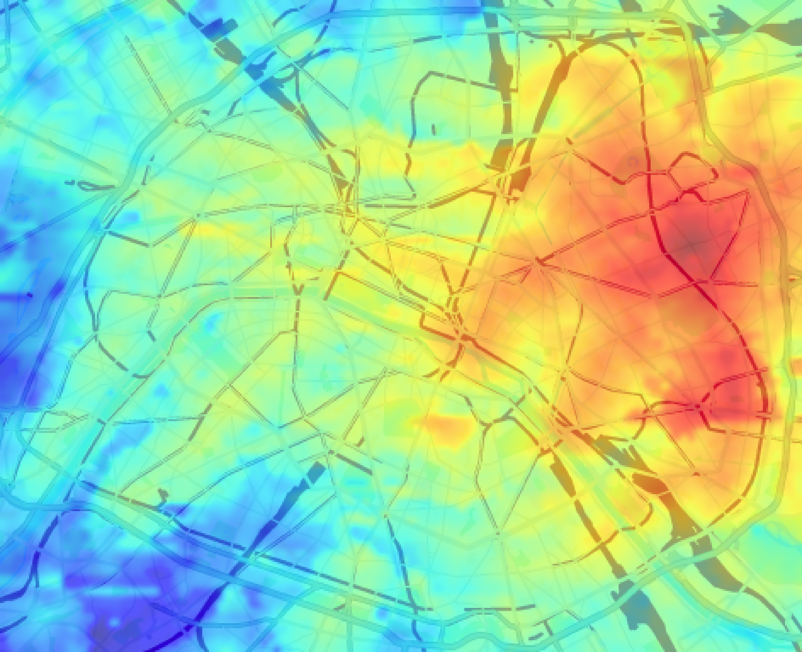

# commute_heat_map

Overlays a public-transit commute-time heat map on top of a Google Maps road map for a given origin address.

Red → short commute. Blue → long commute.

## Usage

### Install

```bash
pip install -e ".[commute-heat-map]"
```

### Command

```bash
commute-heat-map <origin> [options]
```

### Arguments

| Argument | Default | Description |
|---|---|---|
| `origin` | — | Origin address for the commute-time calculation |
| `--grid-size` | `100` | Sampling resolution of the grid (in m) |
| `--api-key-path` | `api_key.txt` next to script | Path to the Google API key file |
| `--heat-map-array-path` | `commute_heat_map.npy` next to script | Path to cache / reload the raw commute-time array |
| `--debug` | off | Save intermediate images (`commute_heat_map_debug.png`, `static_map_debug.png`) and show axes |


## Example

### Goal

Create a commute heatmap from the Parc de Belleville (in the North-East) to anywhere in Paris.

### Command

```bash
commute-heat-map "Parc de Belleville, Paris, France"
```

### Output (`commute_heat_map_final.png`)




## Pipeline

1. **Geocode** — origin address → GPS coordinates via Geocoding API; city name and bounding box (SW/NE corners) are inferred from the same response
2. **Project** — an EQDC coordinate system is centered on the city to convert lat/lng into flat (x, y) meters
3. **Sample** — a regular grid is built over the city bounding box at `--grid-size` metre intervals
4. **Query** — the Routes API returns public-transit travel times from the origin to each grid point; alternative routes are evaluated and the fastest is kept; unreachable points are stored as `NaN`
5. **Interpolate** — cubic interpolation (`scipy.interpolate.griddata`) fills any `NaN` gaps
6. **Render heat map** — the grid is plotted as a `jet_r` colormap (red = short, blue = long) and exported as a high-resolution PNG via `matplotlib`
7. **Static map** — a road map is fetched from the Maps Static API, styled to highlight transit lines, then cropped to match the grid area
8. **Overlay** — the heat map is alpha-blended over the road map → `commute_heat_map_final.png`

The raw commute-time array is saved to `--heat-map-array-path` after the first run; subsequent runs skip the API queries and load it directly.


## Configuration

### Google API key

Follow the guide: https://developers.google.com/workspace/guides/get-started

To create a Google Cloud project with the following specificities:
- Enabled APIs: `Geocoding API` ; `Routes API` ; `Maps Statics API`
- Enabled scope: N/A
- Credentials Type: `API Key`
- API restrictions: the selected APIs above

Save the key to a plain-text file (default: `api_key.txt` in the script directory)

### References

- [Geocoding API](https://developers.google.com/maps/documentation/geocoding)
- [Routes API](https://developers.google.com/maps/documentation/routes)
- [Maps Static API](https://developers.google.com/maps/documentation/maps-static)

### Note

Billing must be enabled on the project, but all three APIs include a free monthly usage quota.
See [Maps pricing](https://developers.google.com/maps/billing-and-pricing/pricing#routes-pricing) for details.
