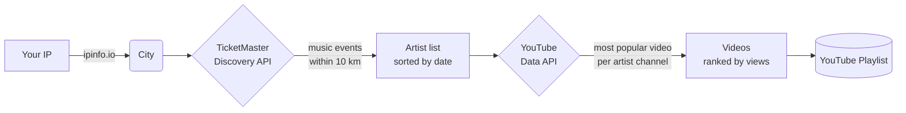

# concert_planner

Builds a YouTube playlist of the most popular songs from artists with upcoming concerts in your city.

Pulls the concert lineup from TicketMaster and turns it into a ready-to-listen playlist — one hit per artist, ranked by view count.

## Usage

### Install

```bash
pip install -e ".[concert-planner]"
```

### Command

```bash
concert-planner [options]
```

### Arguments

| Argument | Default | Description |
|---|---|---|
| `--city` | auto (from IP) | City to search for upcoming concerts |
| `--months-ahead` | `3` | Which upcoming month to look at (0 = current month, 1 = next month, …) |
| `--client-secrets` | `client_secret.json` next to script | Path to the YouTube OAuth client secrets file |
| `--playlist-title` | `Upcoming Concerts` | Title of the YouTube playlist to create (replaces any existing playlist with the same name) |
| `--max-videos` | `50` | Maximum number of videos to add to the playlist |


## Example

### Goal

Build a playlist of artists performing in Paris in 3 months.

### Command

```bash
concert-planner --city Paris
```

### Output

An unlisted YouTube playlist titled *"Upcoming Concerts"*, containing the most popular song from each artist performing that month, sorted by view count.


## Pipeline



1. **Detect city** — inferred from your IP via `ipinfo.io`, or overridden with `--city`
2. **Find concerts** — TicketMaster Discovery API returns music events in the city for the target month (10 km radius, up to 200 results); unique artists are extracted and sorted by their first concert date
3. **Find YouTube channel** — for each artist, the YouTube Data API searches for their official channel
4. **Find top video** — the most-viewed video from that channel is selected; videos longer than 15 minutes are skipped (typically full concerts or documentaries)
5. **Rank** — all videos are sorted by view count
6. **Build playlist** — any existing playlist with the same `--playlist-title` is deleted; a new unlisted playlist is created and filled with the top `--max-videos` songs


## Configuration

### TicketMaster API key

1. Create a developer account at [developer.ticketmaster.com](https://developer.ticketmaster.com/)
2. Retrieve your **API key** from the [getting started page](https://developer.ticketmaster.com/products-and-docs/apis/getting-started/)
3. Save it to a plain-text file (default: `ticketmaster_token.txt` in the script directory)

### YouTube OAuth credentials

1. Follow the [Google Cloud setup guide](https://developers.google.com/workspace/guides/get-started) to create a project with:
   - Enabled API: `YouTube Data API v3`
   - Enabled scope: `youtube.force-ssl`
   - Application type: **Desktop**
   - Credentials type: **OAuth 2.0 Client ID**

2. Download the client secret file and save it as `client_secret.json` in the script directory (or pass its path with `--client-secrets`)

3. On first run you will be prompted to visit a URL to authorize access to your YouTube account — a token is then saved locally for subsequent runs

### References

- [YouTube Data API v3](https://developers.google.com/youtube/v3/docs)
- [TicketMaster Discovery API](https://developer.ticketmaster.com/products-and-docs/apis/discovery-api/v2/)

### Note

- `TicketMaster` vs `BandsInTown`

While the `TicketMaster` API limits you to events they are selling ticket for,
`BandsInTown` seems to have a more comprehensive list of upcoming events.
But their API is not open to all.

Having an artist account seems to include some API access.
But not sure how much.
See: https://help.artists.bandsintown.com/en/articles/7053475-what-is-the-bandsintown-api
